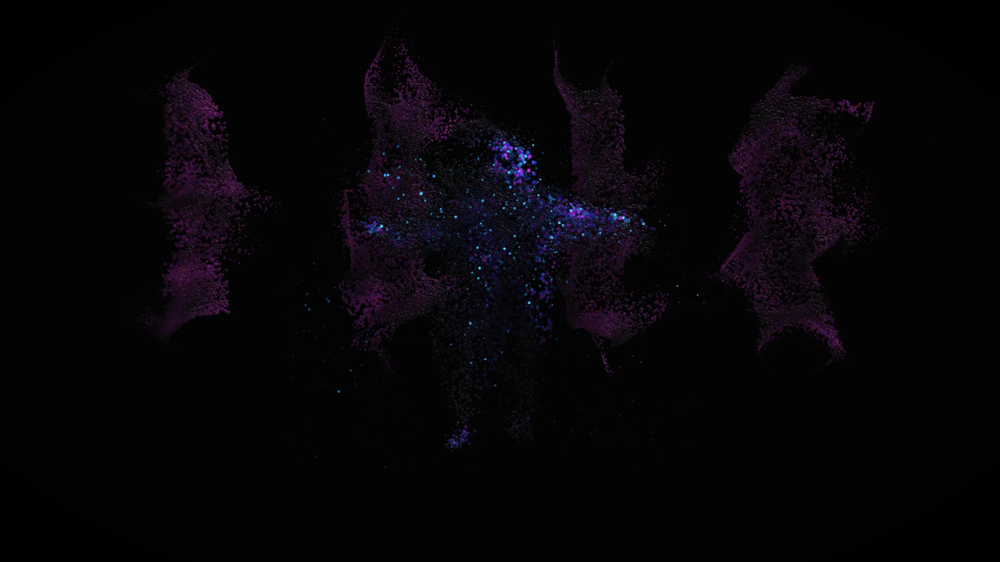

## Kinesis
*An interactive audio visual exploration of change and motion in time and space.*

Moments are being reflected in a time warping mirror  –  everything is and then dissolves. While time is in motion everything flows. Everything we do leaves behind traces.  
The project invites the user to explore time and space experimentally.

The installation is set up with a Microsoft Kinect ONE, a pair of speakers, a projector and a PC running vvvv gamma and MaxMSP.
The movement of the user is being tracked and influences the soundscape and the visuals at the same time. The tracking part and also the generation of the visuals happen within vvvv, the tracking data however is transferred via OSC to MaxMSP that generates the reactive audio layer.

The [**Documentation**](https://github.com/TimSBB/Kinesis/tree/main/documentation) can be found here.

This is the [**Trailer**](https://vimeo.com/manage/videos/687254045).

Here you'll find a description of [**How To**](https://github.com/TimSBB/Kinesis/blob/main/documentation/HowTo.md) run the installation.