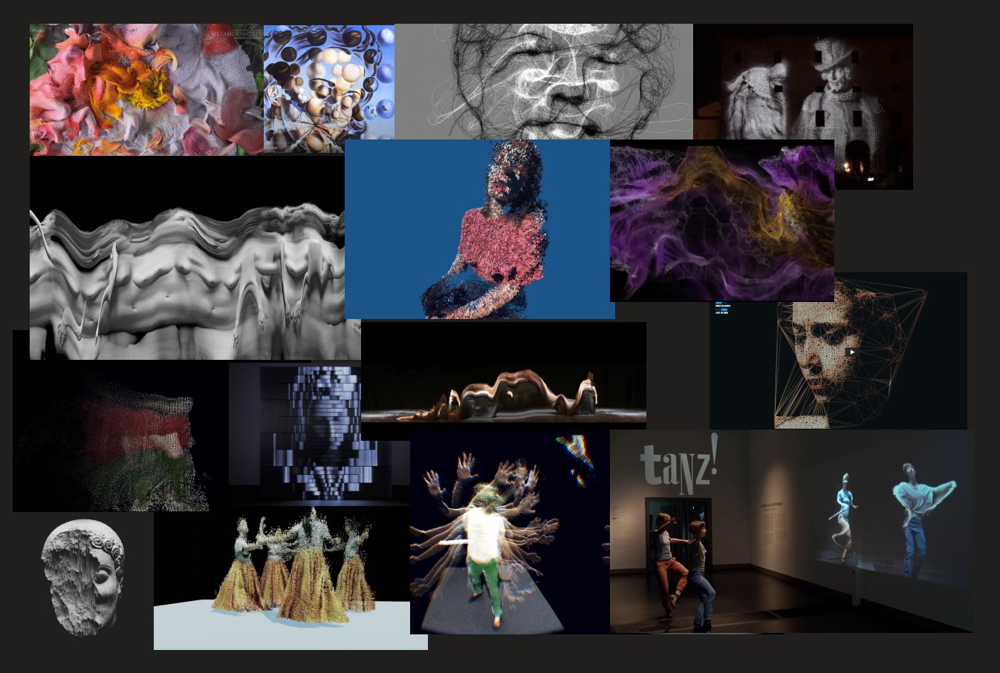

# Project plan

## Project description

### Kinesis
<!-- flow, emenate, radiate?, chronos? -->

*An interactive audio visual exploration of change and motion in time and space.*

How can we even percieve motion when we can only see one fraction of it at a time? What is the connection between the now and the past? And what is the past? Isn't it already gone?  
We can capture the moment, trap the light. We can reflect it endlessly in our minds and loop through the slices of time we percieved. But it will never be again. It was! The memory of the moment fades, is being abstracted and alienated.  

*This is what __Kinesis__ visualizes. Moments are being reflected in a time warping mirror  –  everything is and then dissolves. While time is in motion everything flows. Everything we do leaves behind traces.  
The project invites the user to explore time and space experimentally.*
> "Everything happens,  
because with time everything meets,  
and in the free range of spaces  
and in the continuous succession of movement,  
all matter is stirred,  
any form given,  
all figures printed;  
so everything is coming or going,  
all is joined or running away,  
all is combined or opposed,  
everything happens or is destroyed  
by relative or contrary forces,  
that are the only constants,  
and balancing without harm,  
they animate the universe  
and make it into a theater  
with ever new scenes  
and objects incessantly reborn"  
**Comte de Buffon, in 1783**

The installation is set up with a Microsoft Kinect ONE, a pair of speakers, a projector and a PC running vvvv gamma and MaxMSP.
The Kinect is delivering not only the rgb image of the people in front of the installation but also a depth map. The movement of the user is being tracked and influences the soundscape and the visuals at the same time. The tracking part and also the generation of the visuals happen within vvvv, the tracking data however is transferred via OSC to MaxMSP that generates the reactive audio layer.

---

### Inspiration

Moodboard

I want to and have to point out four projects that are really close to what I am aiming for:

- [Mirror (M2)](http://schnellebuntebilder.de/projects/mirror-m2/).
- [Blink of an eye](http://schnellebuntebilder.de/projects/blink-of-an-eye/)
- [Momentum](http://schnellebuntebilder.de/projects/momentum/)
  
all three of them by schnellebuntebilder, two of them together with kling klang klong

- [Perceptual Myth](https://www.aristidesgarcia.de/perpetual-myth)

by Aristides Garcia

---

### Goal

My motivation for this project is not to reinvent the wheel. I basically want to learn how to do the stuff I was always inspired by. __I want to learn how to properly work with GPU based rendering and computing within vvvv and also how to work with interactive sound generation.__  
As most of my inspiration is heavily based on particle systems, my project most likely also will. But as soon as I entered GPU land I could also imagine working with SDFs and such. I would also try to bring in a new artistic expresssion, I don't want to just imitate and copy from my inspiration.

---

## Best and Worst Case Scenarios

**Best Case:**

- Timelined dramaturgy for interactive visual modes and interactive audio layer
- exhibition ready, easy executable installation
- No memory leaks, no manual readjustments needed
- Support for multiple users
- Reaching a satisfying level of immersion, similar to the inspirational projects
  
**Worst Case:**

- basic switching between visual modes and basic musical backdrop
- prototypical set up
- manual readjustments needed
- No support for multiple users
- basic interactive but not really immersive experience compared to the inspirational projects
---

## Timetable

**January:**

- Week 1: Find and test out the basic software set up.
- Week 2: Implement timeline and create visual modes.
- Week 3: Focus on audio. Decide in which way sound will be interactive.
- Week 4: Implement multiple user support and work on visuals.

**February:**  

- Week 1: Finish assignments for other courses.
- Week 2: Layout and animate visual modes in timeline and adjust audio based on that.
- Week 3: Work more on the visuals and audio based on the intended dramturgy.
- Week 4: Create final dramaturgy and precisely animate.

**March:**

- Week 1: Polishing.
- Week 2: Documentation and cutting of trailer. Preparation of presentation.
